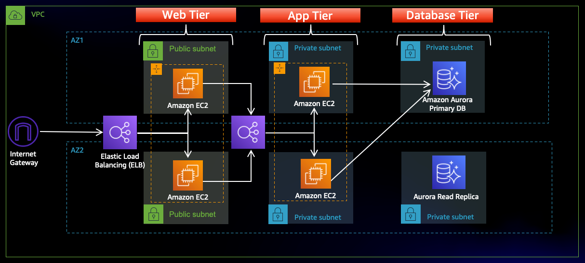

# Terraform and AWS: Building a 3-Tier Web Application Architecture

## Introduction
This project demonstrates a typical cloud architecture pattern: a public-facing Application Load Balancer (ALB) directs incoming traffic to a web tier composed of EC2 instances. These instances host Nginx servers, which serve a React.js website and route API requests to the application tier's internal ALB. This internal ALB then directs the traffic to the application tier of EC2 instances running a Node.js application. This application interacts with a multi-AZ Aurora MySQL database cluster and sends the processed data back to the web tier. To ensure high availability, load balancing, health checks, and autoscaling groups are implemented at each layer. You can find a similar example in this [AWS workshop](http://catalog.us-east-1.prod.workshops.aws/workshops/85cd2bb2-7f79-4e96-bdee-8078e469752a/en-US).

However, setting up such an architecture manually can be time-consuming: the AWS workshop estimates it can **take approximately 3 hours**, and potentially longer for those unfamiliar with the process.

In a business setting, this is far from ideal. To speed up the process, automation or infrastructure as code (IaC) tools, such as HashiCorp's Terraform, are essential. 

**With a single click**, this process can be significantly expedited.